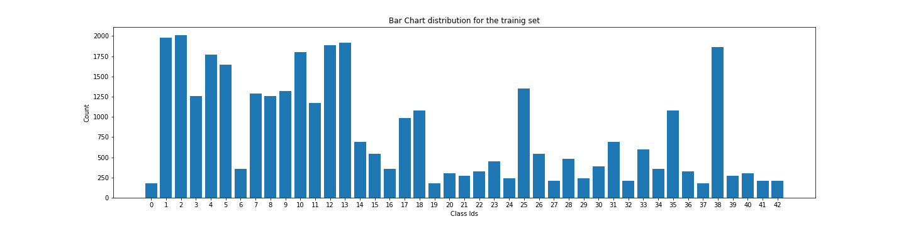
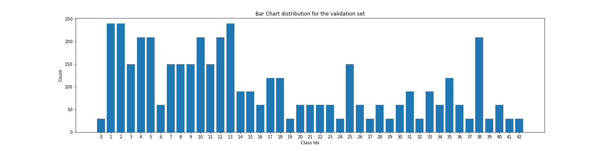
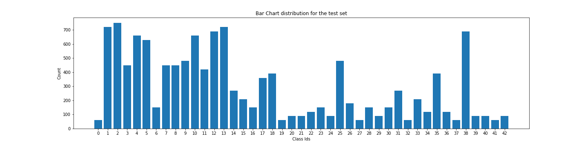
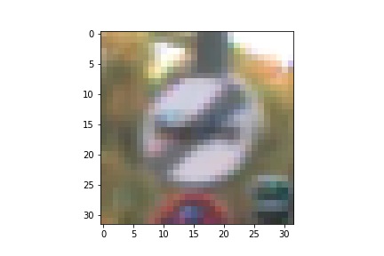
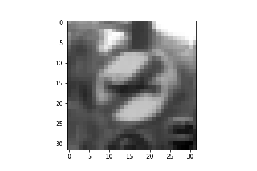
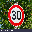

# **German Traffic Sign Recognition** 

This ia a German traffic sign recognition project built using convolutional neural network(Lenet-5)

The goals / steps of this project are the following:
* Load the data set
* Explore, summarize and visualize the data set
* Design, train and test a model architecture
* Use the model to make predictions on new images
* Analyze the softmax probabilities of the new images

### Load the Data Set
Download the [dataset](https://d17h27t6h515a5.cloudfront.net/topher/2017/February/5898cd6f_traffic-signs-data/traffic-signs-data.zip)
```
$ wget https://d17h27t6h515a5.cloudfront.net/topher/2017/February/5898cd6f_traffic-signs-data/traffic-signs-data.zip
```

### Explore, Summarize and Visualize the Data Set
This is a pickled dataset in which images are already resized to 32x32 and contains training, test and validation data set. The zip file also contains a CSV file (signnames.csv) in which the first column contains the class Id(an integer ranging from 0-42 also seen as number of classes) and the second column contains the description of the classIds. Below are the first three rows from CSV file

| ClassId| SignName    |
| :-----:|-------------|
| 0      | Speed limit (20km/h) |
| 1      | Speed limit (30km/h) |
| 2      | Speed limit (50km/h) |

Below is a brief summary of the data set which is done using numpy
```
Number of training examples = 34799
Number of validation examples = 4410
Number of testing examples = 12630
Image data shape = (32, 32, 3)
Number of classes = 43
```

The exploratory visualization of the data set contains the bar chart showing the count of each type of classes(traffic signs) in the training, validation and test set. I have also plotted a single traffic sign image of each class using matplotlib.

#### Bar chart showing the distribution of training set


#### Bar chart showing the distribution of validation set


#### Bar chart showing the distribution of test set


### Design, Train and Test a model architecture

#### Preprocessing
As a first step I decided to convert the images to grayscale as I am using Lenet-5 neural network for training which works well with the gray scale images also there is limited color info in the traffic signs so I thought may be the structure of the signs will be sufficient and it will reduce the complexity of the model also.

#### Initial color image


#### Grayscale Image


Next, I performed min-max normalization to rescale the pixels to the 0-1 floating-point range so that there is not too much higher values while training the model as higher values may causes some problems in the convergence of the gradient descent optimizer and may take longer

As a last step, I standardized the data using Z-score normalization with 0 mean and unit variance.

#### Model Architecture Design
My final model consisted of the following layers:

| Layer         		|     Description	        					| 
|:---------------------:|:---------------------------------------------:| 
| Input         		| 32x32x1 Grayscale image   					| 
| Convolution 5x5     	| 1x1 stride, VALID padding, outputs 28x28x6 	|
| RELU					|												|
| Max pooling	      	| 2x2 stride, VALID padding, outputs 14x14x6 	|
| Convolution 5x5	    | 1x1 stride, VALID padding, outputs 10x10x16.  |
| RELU		            |         									    |
| Max pooling		    | 2x2 stride, VALID padding, outputs 5x5x16     |
| Fully connected		| Input = 400, Output = 120						|
| RELU					|												|
| Dropout				| Keep Prob of 0.8								|
| Fully connected		| Input = 120, Output = 84						|
| RELU					|												|
| Dropout				| Keep Prob of 0.8								|
| Fully connected		| Input = 84, Output = 43						|

#### Training
To train the model, I used the model architecture described above. The hyperparameters used in the training is described below:
```
EPOCHS = 200
BATCH_SIZE = 128
rate = 0.001
mu = 0
sigma = 0.1
```
I used the SGD(stochastic gradient descent) approach for optimizing the network with a batch size of 128 and a learning rate of 0.001. While training I used a more sophisticated optimizer called Adam Optimizer. The weights and biases of the network are normally initialized with a mean of 0 and a variance of 0.1. The classes/labels are one hot encoded. And in the output Softmax function is applied as probabilities are easier otherwise the output value may be too high or too low. 
To achieve the desired accuracy I increased the number of epochs in the model architecture as Lenet-5 is good for classification where number of claases are less but in this case number of classes is more so instead of adding more layers into the network I increased the epochs, added regularization using dropout with keep probability of 0.8 to avoid overfitting in the fully connected layers, preprocess the data set.

#### Testing
My final model results were:
```
Training accuracy = 1.000
Validation accuracy = 0.962
Test accuracy = 0.946
```

In this project, I choose Lenet-5 as my model architecture with some modifications of my own as I think current architecture is suitable for my problem statement. As the traffic signs doesn't have very complicated shapes, structures or figures a simple neural network such as Lenet-5 with slight modification is a good to go network which is clearly evident from validation set accuracy. The test set accuracy is not very high which can be further improved by adding more layers in the network but for this problem statement I think this is a good starting point. A higher validation accuracy is an indicator that the model is not overfitted and can make predictions well.

### Use the model to make predictions on New Images
To make predictions on new images I downloaded five German traffic signs from internet which are enclosed below

 

 
 


The model generally correctly identifies all the test data set except the caution one i.e. second test image and is confused with keep right traffic signal which is kind of strange. I think this may happen because the test image is blurry and not centered. Also the fourth test image which is speed limit 30 kmph may be misclassified as speed limit 70 kmph as when you resize the image and if the traffic sign is not centered in the image 30 can be misread as 70 or vice versa. 

#### Here are the results of the prediction:

| Image			        |     Prediction	        					| 
|:---------------------:|:---------------------------------------------:| 
| Children Crossing    	| Children Crossing   							| 
| Caution     			| Keep Right 									|
| Road Work				| Road Work										|
| Spped limit(30 kmph)	| Spped limit(30 kmph)					 		|
| No Entry			    | No Entry      							    |


The model was able to correctly guess 4 out of the 5 traffic signs, which gives an accuracy of 80%. This compares favorably to the accuracy on the test set of 94.6% because the test set has 12630 samples.

### Analyze the softmax probabilities of the new images

| Probability         	|     Prediction	        					| 
|:---------------------:|:---------------------------------------------:| 
| .99         			| Children Crossing   							| 
| .99     				| Keep Right 									|
| 1.00					| Road Work										|
| .52	      			| Spped limit(30 kmph)					 		|
| 1.00				    | No Entry      							    |


For the second image the softmax probability is very high which is a wrong prediction. 


